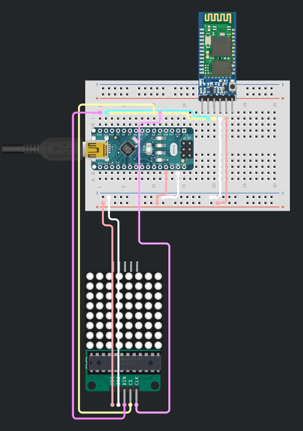

# subtitles
Live-ish physical subtitles *displayed* using arduino

# components
- MAX7219 32x8 (x4 daisy chained 8x8)
- Arduino Nano and 5v power supply
- HC 05 Bluetooth Module

# diagram
(single matrix shown here)  

# how to use
- power and **pair the HC-05 to your device** (pin is usually 1234). (it may immediately disconnect after pairing even though its powered, that's OK)
- make sure to install and include the following libraries:
    -  MD_Parola
    -  MD_MAX72xx
    -  SoftwareSerial
- adjust the pinouts and BT pin assignments in subtitles.ino to match your actual wiring
- upload subtitles.ino to the nano and make sure it is running
- run sub_blu.py and wait for it to connect to the HC-05
- now wait for sub_blu.py to adjust for ambient noise (5 seconds) and begin speaking
- stop speaking to trigger recognition and it will be sent to the display
- wait a second or two before subsequent blocks of speech

# what next
Possible replacement of the nano with a Pi zero 2 W or similar proper IoT board, to move all speech to text and display operations onto a single board.
